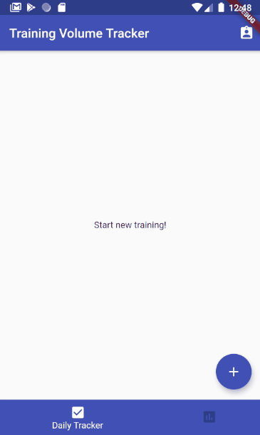

# ワークアウトボリュームトラッカー

このプロジェクトは筋力トレーニングの際に、トレーニングのボリューム量（Weight x 回数）を記録することができるアプリです。  
[こちら](https://play.google.com/store/apps/details?id=com.ysk.kissy.volume_tracker)で公開しております。  
このアプリを作った意図としては、
- とりあえず、Flutter学んだのでアプリを1つ作ってみたい
  - シンプルなとっかかりとして記録系アプリが良さそう
  - ただのTODOアプリを作っても面白くない
  - 自分の中で課題になっていることはなにか
    - 筋トレ中のメニュー記録アプリにしよう
- 他アプリとは差別化したい
  - 1週間をスパンとして、どれぐらいの負荷を筋肉に与えられたのかを可視化
  - 他アプリだとトレーニングメニューが多々ある中、毎回一つ一つのメニューに対して記録する煩雑さがある
    - アプリ内でメニューを探す時間によって筋肉のパンプが冷めてしまうのを避けたい
    - そもそも筋トレメニューはルーティンになっているので部位さえ記録しておけば、思い出せるのではないか
    - シンプルに記録を残していきたい

が自分の中であったので、製作に至りました。

# 使っているライブラリ
- intl: ^0.16.1
  - 時間表示・変換
- provider: ^4.0.5+1
  - 状態管理
- charts_flutter: ^0.9.0
  - グラフ作成
- path: ^1.6.4
  - 内部DB用
- sqflite: ^1.3.0+1
  - ローカルDB
- flutter_launcher_icons: ^0.8.1
  - 起動時にアイコンを表示させる

# TODO
+ [ ] ライブラリのバージョンアップデート
+ [ ] Flutter2.0対応
+ [ ] 状態管理をproviderからriverpodへ移植